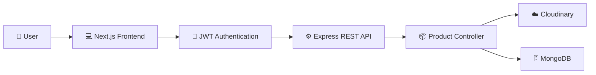
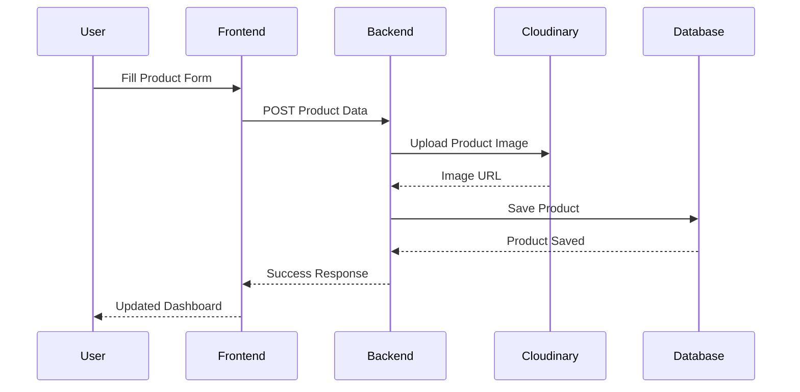
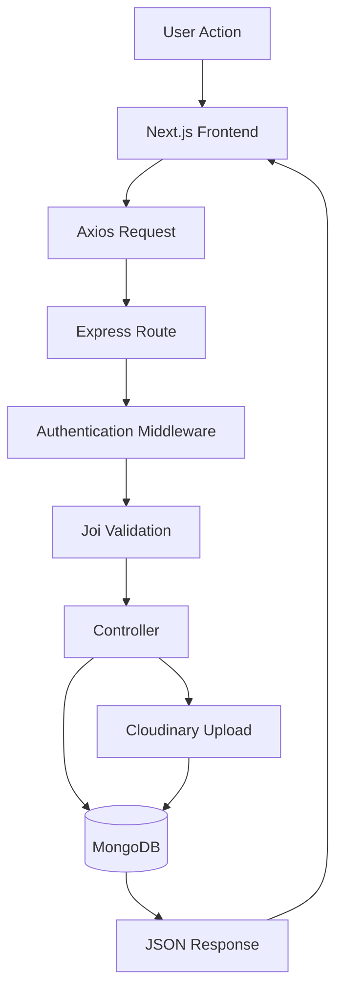
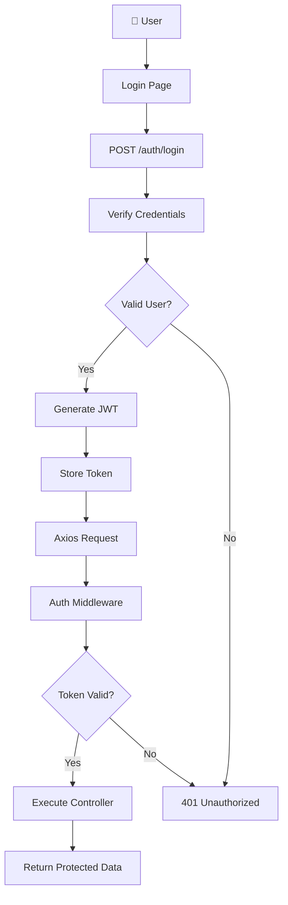
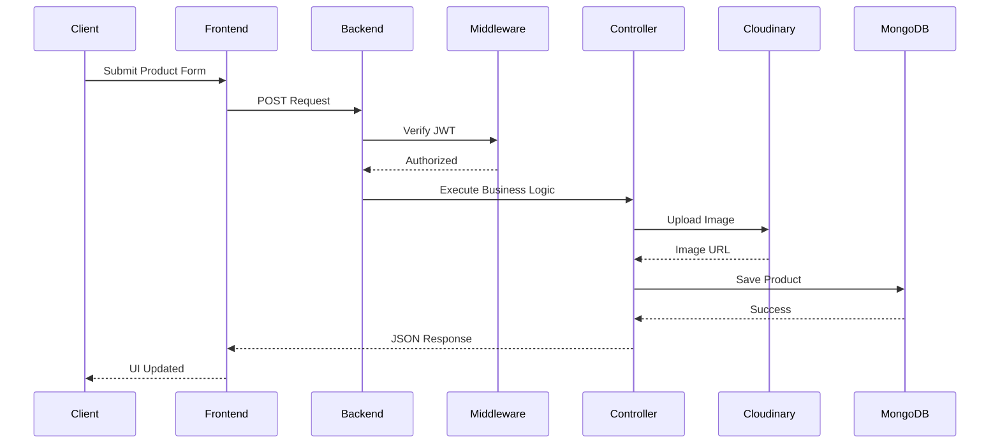
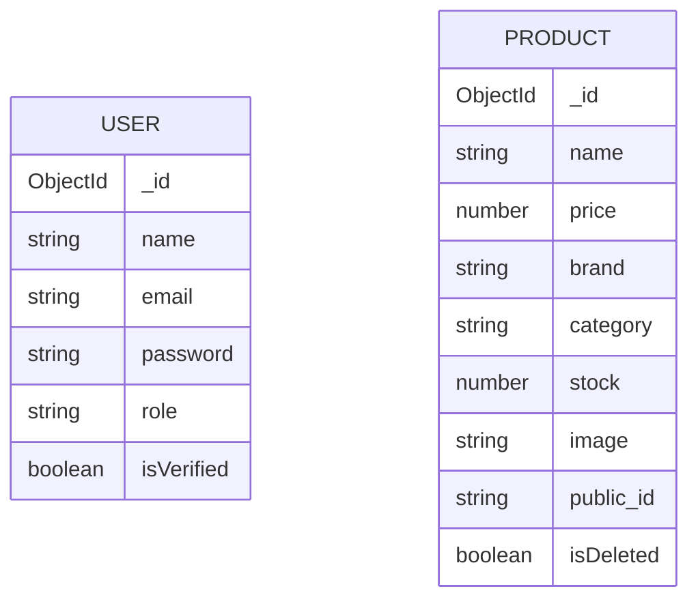
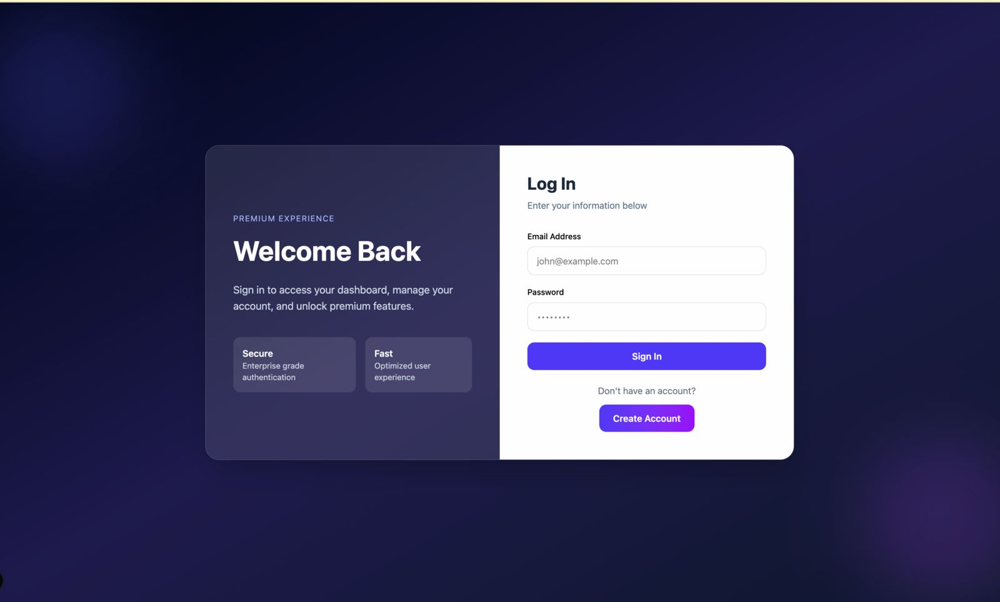
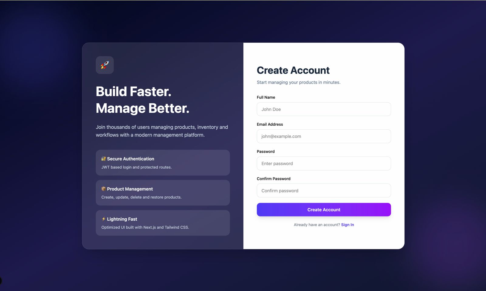
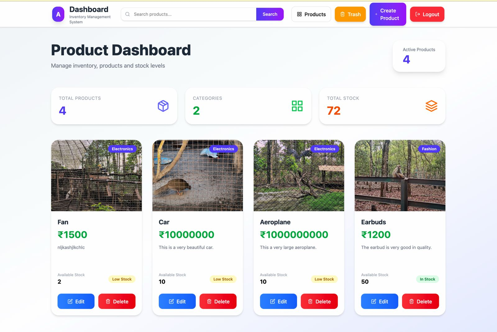
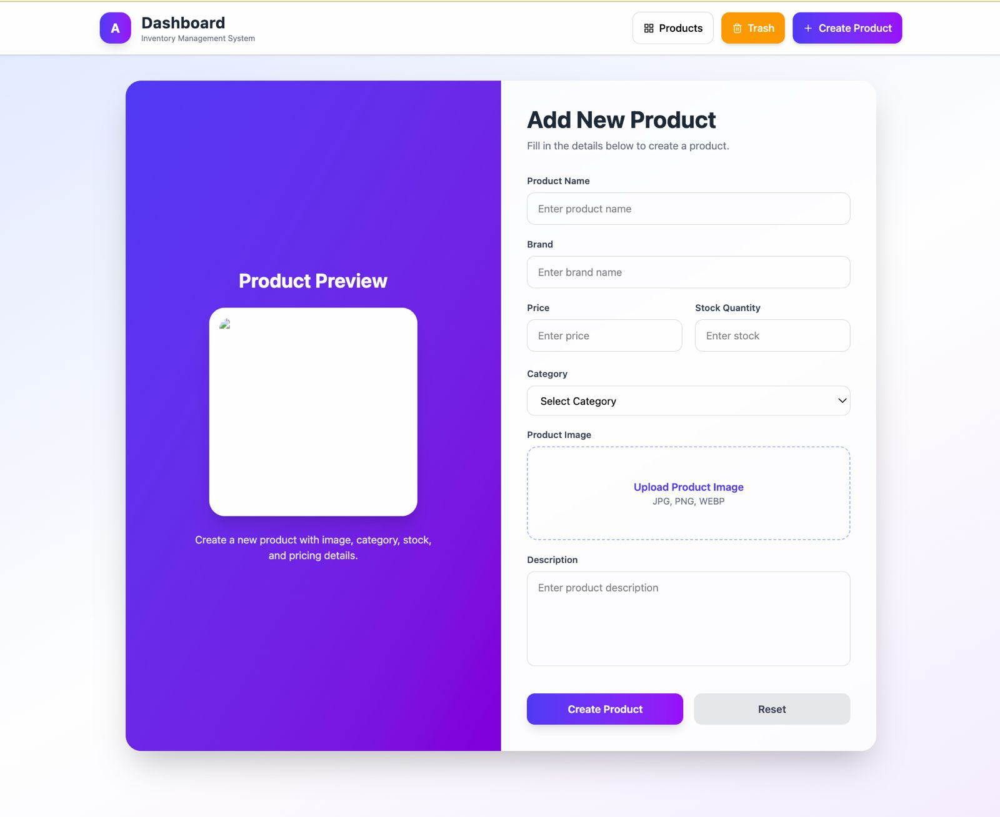

<!-- ========================================================= -->
<!--                PRODUCT MANAGEMENT PLATFORM               -->
<!-- ========================================================= -->

<h1 align="center">

🚀 Product Management Platform

</h1>

<h3 align="center">

Modern Full Stack Inventory Management System

</h3>

<p align="center">

A production-ready inventory management platform built with <b>Next.js</b>, <b>Express.js</b>, <b>MongoDB</b>, <b>JWT Authentication</b>, and <b>Cloudinary</b>.

</p>

<p align="center">


</p>

---

<p align="center">


</p>

<p align="center">


</p>

---

<p align="center">

<a href="#-overview">Overview</a> •

<a href="#-key-features">Features</a> •

<a href="#-tech-stack">Tech Stack</a> •

<a href="#-installation">Installation</a> •

<a href="#-screenshots">Screenshots</a> •

<a href="#-author">Author</a>

</p>

---

# 🌐 Live Demo

> 🚧 **Currently under development**

| Frontend | Backend |
|-----------|----------|
| Coming Soon | Coming Soon |

---

# 📑 Table of Contents

- [✨ Overview](#-overview)
- [🎯 Why This Project?](#-why-this-project)
- [🌟 Key Features](#-key-features)
- [🛠 Tech Stack](#-tech-stack)
- [🏗 Architecture](#-architecture)
- [📂 Folder Structure](#-folder-structure)
- [🔐 Authentication Flow](#-authentication-flow)
- [🌐 API Documentation](#-api-documentation)
- [🗄 Database Design](#-database-design)
- [📸 Screenshots](#-screenshots)
- [⚙ Installation](#-installation)
- [🔑 Environment Variables](#-environment-variables)
- [🚀 Future Improvements](#-future-improvements)
- [🤝 Contributing](#-contributing)
- [👨‍💻 Author](#-author)

---

# ✨ Overview

**Product Management Platform** is a modern **full-stack inventory management application** built to demonstrate production-ready web development practices. It enables authenticated users to securely manage product data through an intuitive dashboard while following a clean and scalable architecture.

The project combines a **Next.js** frontend with an **Express.js** REST API and **MongoDB** database to provide a complete product lifecycle solution, including authentication, image uploads, validation, search, and secure CRUD operations.

Rather than being a basic CRUD application, this project focuses on implementing concepts commonly used in real-world software development, such as secure authentication, middleware-based request handling, cloud image storage, API validation, and modular project architecture.

---

# 🎯 Problem Statement

Managing inventory manually becomes inefficient as product data grows. Businesses need a centralized system where products can be created, updated, searched, and maintained securely while ensuring data consistency and an intuitive user experience.

This project addresses those challenges by providing a secure product management platform that enables users to:

- 📦 Organize and manage products efficiently
- 🔍 Search products instantly
- ☁️ Upload and manage product images
- ♻️ Restore accidentally deleted products
- 🔐 Protect sensitive operations through authentication
- 📱 Access the application from any device with a responsive interface

The primary goal was to build an application that reflects the architecture and development practices of modern production systems rather than a simple academic CRUD project.

---

# 🚀 Project Highlights

<table>

<tr>

<td align="center" width="25%">

### 🔐

### Secure Authentication

JWT-based authentication with protected routes and password hashing using bcrypt.

</td>

<td align="center" width="25%">

### ☁️

### Cloud Storage

Product images are uploaded and managed securely using Cloudinary.

</td>

<td align="center" width="25%">

### 🛡

### Secure Backend

Helmet, Joi validation, middleware, and rate limiting protect the API.

</td>

<td align="center" width="25%">

### 📱

### Responsive UI

Modern responsive interface built with Next.js and React.

</td>

</tr>

<tr>

<td align="center">

### 📦

### Product Management

Complete product lifecycle with Create, Read, Update, Delete, Search, and Restore functionality.

</td>

<td align="center">

### ⚡

### REST API

Well-structured Express.js REST APIs with modular controllers and middleware.

</td>

<td align="center">

### 🗄

### MongoDB

Persistent data storage using MongoDB and Mongoose models.

</td>

<td align="center">

### 🧩

### Scalable Architecture

Organized folder structure with reusable components and clean separation of concerns.

</td>

</tr>

</table>

---

# 🌟 Key Features

## 🔐 Authentication & Security

- JWT-based Authentication
- Secure Password Hashing with bcrypt
- Protected Routes
- Express Authentication Middleware
- Helmet Security Headers
- Express Rate Limiting
- Cookie-Based Authentication
- Joi Request Validation

---

## 📦 Product Management

- Create New Products
- Update Existing Products
- Delete Products
- Soft Delete Support
- Restore Deleted Products
- Permanent Delete
- Product Listing
- Product Details
- Product Search

---

## ☁️ Image Management

- Cloudinary Image Upload
- Automatic Image Storage
- Image Preview
- Asset Management
- Cloud Image Deletion

---

## 💻 Frontend Features

- Modern Next.js App Router
- Responsive Dashboard
- Clean User Interface
- Client-side Navigation
- React Hook Form Integration
- Yup Form Validation
- Axios API Communication
- Modular Components

---

## ⚙ Backend Features

- RESTful API Architecture
- Modular Controller Structure
- Middleware-Based Request Handling
- MongoDB Integration
- Mongoose Models
- Centralized Error Handling
- Input Validation
- Secure API Design

---

## 💡 Why This Project Stands Out

Unlike a basic CRUD demonstration, this project incorporates several production-oriented engineering practices:

- ✅ Full Stack Architecture
- ✅ Secure Authentication Flow
- ✅ Cloud-Based Image Management
- ✅ API Validation
- ✅ Modular Code Organization
- ✅ Responsive User Experience
- ✅ Production-Ready Folder Structure
- ✅ Real-World Development Practices
- ✅ Maintainable and Scalable Codebase

---
# 🛠 Tech Stack

This project leverages a modern full-stack JavaScript ecosystem to deliver a scalable, secure, and responsive product management platform.

---

## 🎨 Frontend

| Technology | Purpose |
|------------|---------|
|  | React Framework |
|  | User Interface |
|  | Type Safety |
|  | Styling |
|  | API Communication |
|  | Form Handling |
|  | Client-side Validation |

---

## ⚙ Backend

| Technology | Purpose |
|------------|---------|
|  | JavaScript Runtime |
|  | REST API |
|  | Database |
|  | ODM |
|  | Authentication |
|  | Password Encryption |
|  | Request Validation |
|  | HTTP Security |
|  | API Protection |
|  | File Upload |
|  | Image Storage |

---

## 🧰 Development Tools

| Tool | Purpose |
|------|---------|
| Git | Version Control |
| GitHub | Repository Hosting |
| VS Code | Code Editor |
| Postman | API Testing |
| npm | Package Management |

---

# 🏗 System Architecture

The application follows a layered architecture where each layer has a dedicated responsibility.

- **Presentation Layer** → Next.js frontend responsible for UI rendering and user interactions.
- **API Layer** → Express.js REST APIs process requests and enforce business logic.
- **Authentication Layer** → JWT middleware validates users before allowing access.
- **Storage Layer** → MongoDB stores structured data while Cloudinary manages media assets.

---

## 📐 High-Level Architecture



---

## 🔄 Product Request Lifecycle

Whenever a user creates a product, the following workflow occurs:



---

## 🔁 Complete Request Flow



---

# 📂 Project Structure

```text
📦 Product CRUD Platform

├── 📂 backend
│
│   ├── 📂 app
│   │
│   ├── 📂 config
│   │   ├── db.js
│   │   └── cloudinary.js
│   │
│   ├── 📂 controller
│   │   ├── AuthController.js
│   │   └── ProductController.js
│   │
│   ├── 📂 middleware
│   │   ├── auth.js
│   │   ├── multer.js
│   │   └── validation.js
│   │
│   ├── 📂 models
│   │   ├── User.js
│   │   └── Product.js
│   │
│   ├── 📂 routes
│   │   ├── authRoutes.js
│   │   └── productRoutes.js
│   │
│   └── 📂 utils
│
│
├── 📂 frontend
│
│   ├── 📂 app
│   │
│   ├── 📂 auth
│   ├── 📂 home
│   ├── 📂 addProduct
│   ├── 📂 editProducts
│   ├── 📂 trash
│   │
│   ├── 📂 components
│   │
│   ├── 📂 api
│   │
│   ├── 📂 hooks
│   │
│   ├── 📂 public
│   │
│   └── middleware.ts
│
│
├── README.md
│
└── package.json
```

---

# 🎯 Architecture Highlights

<table>

<tr>

<td align="center">

### 🧩 Modular

Frontend and backend are cleanly separated for maintainability.

</td>

<td align="center">

### 🔒 Secure

Authentication, validation, and security middleware protect the application.

</td>

<td align="center">

### ☁️ Cloud Ready

Images are stored in Cloudinary instead of the local filesystem.

</td>

</tr>

<tr>

<td align="center">

### ⚡ Fast

Next.js App Router delivers a smooth and responsive user experience.

</td>

<td align="center">

### 📈 Scalable

Layered architecture makes the project easy to extend with additional features.

</td>

<td align="center">

### ♻️ Maintainable

Reusable components and modular controllers reduce code duplication.

</td>

</tr>

</table>

---
# 🔐 Authentication Flow

The application implements **JWT (JSON Web Token)** based authentication to ensure secure access to protected resources.

Every protected API request passes through an authentication middleware that validates the user's identity before executing business logic.

---

## 🔄 Authentication Workflow



---

## 🔒 Authentication Features

- JWT Authentication
- Protected Routes
- Password Hashing using bcrypt
- Middleware-Based Authorization
- Cookie-Based Session Handling
- Secure API Access
- Request Validation
- Unauthorized Request Handling

---

# 🌐 API Documentation

The backend exposes a RESTful API for authentication and product management.

---

## Authentication APIs

| Method | Endpoint | Description | Access |
|---------|----------|-------------|--------|
| POST | `/auth/register` | Register a new account | 🌐 Public |
| POST | `/auth/login` | Authenticate user | 🌐 Public |

---

## Product APIs

| Method | Endpoint | Description | Access |
|---------|----------|-------------|--------|
| GET | `/products` | Fetch all active products | 🔐 Protected |
| GET | `/products/list` | List products | 🔐 Protected |
| POST | `/products/create` | Create new product | 🔐 Protected |
| POST | `/products/update/:id` | Update existing product | 🔐 Protected |
| GET | `/products/search` | Search product | 🔐 Protected |
| PUT | `/products/soft-delete/:id` | Move product to trash | 🔐 Protected |
| PUT | `/products/restore/:id` | Restore product | 🔐 Protected |
| DELETE | `/products/hard-delete/:id` | Permanently delete product | 🔐 Protected |
| GET | `/products/trash` | View deleted products | 🔐 Protected |

---

# 📡 API Request Example

## Create Product

### Endpoint

```http
POST /products/create
```

### Request Headers

```http
Authorization: Bearer <JWT_TOKEN>

Content-Type: multipart/form-data
```

### Request Body

```json
{
  "name": "iPhone 16 Pro",
  "price": 129999,
  "brand": "Apple",
  "category": "Mobile",
  "stock": 15,
  "description": "Latest flagship smartphone"
}
```

---

### Success Response

```json
{
  "status": true,
  "message": "Product created successfully",
  "data": {
    "_id": "...",
    "name": "iPhone 16 Pro",
    "price": 129999
  }
}
```

---

### Error Response

```json
{
  "status": false,
  "message": "Validation failed"
}
```

---

# 🔄 API Lifecycle



---

# 🗄 Database Design

The application stores user and product information using **MongoDB** with **Mongoose ODM**.

---

## 👤 User Collection

| Field | Type | Description |
|------|------|-------------|
| name | String | User's Full Name |
| email | String | Unique Email Address |
| password | String | bcrypt Hashed Password |
| role | String | User Role |
| isVerified | Boolean | Verification Status |
| createdAt | Date | Created Timestamp |
| updatedAt | Date | Updated Timestamp |

---

## 📦 Product Collection

| Field | Type | Description |
|------|------|-------------|
| name | String | Product Name |
| price | Number | Product Price |
| brand | String | Brand Name |
| category | String | Product Category |
| stock | Number | Available Stock |
| description | String | Product Description |
| image | String | Cloudinary Image URL |
| public_id | String | Cloudinary Public ID |
| isDeleted | Boolean | Soft Delete Flag |
| createdAt | Date | Created Timestamp |
| updatedAt | Date | Updated Timestamp |

---

## 🧬 Entity Relationship Diagram



> **Current implementation:** The `Product` collection is not directly linked to a `User`. Products are managed globally. In a future version, a `createdBy` field could establish ownership for multi-user product management.

---

# 🛡 Security Features

The application follows several security best practices to protect users, APIs, and uploaded assets.

| Feature | Purpose |
|---------|---------|
| 🔐 JWT Authentication | Protect API endpoints |
| 🔑 bcrypt | Secure password hashing |
| 🛡 Helmet | Security headers |
| 🚦 Express Rate Limiter | Prevent abuse |
| ✅ Joi Validation | Validate incoming requests |
| 📤 Multer | Secure file uploads |
| ☁️ Cloudinary | Cloud-based image storage |
| 🔒 Protected Routes | Restrict unauthorized access |

---

# 📈 Project Statistics

| Category | Details |
|----------|---------|
| 🖥 Frontend | Next.js, React, TypeScript |
| ⚙ Backend | Express.js, Node.js |
| 🗄 Database | MongoDB + Mongoose |
| 🔐 Authentication | JWT + bcrypt |
| ☁️ Image Storage | Cloudinary |
| 📦 API Style | RESTful Architecture |
| 🛡 Security | Helmet, Rate Limiting, Joi |
| 🎨 UI | Responsive Design |
| 📱 Architecture | Full Stack MERN |

---
# 📸 Screenshots

A glimpse into the application's user interface.

---

## 🔐 Login

<p align="center">

</p>

<p align="center">
<b>Secure sign-in experience for authenticated users.</b>
</p>

---

## 📝 Register

<p align="center">

</p>

<p align="center">
<b>Create a new account to access the product management workspace.</b>
</p>

---

## 🏠 Dashboard

<p align="center">

</p>

<p align="center">
<b>View, search, and manage all products from a clean and responsive dashboard.</b>
</p>

---

## ➕ Add Product

<p align="center">

</p>

<p align="center">
<b>Create a new product with validation and Cloudinary image upload.</b>
</p>

---

# ⚙️ Installation

## Prerequisites

Before running the project, ensure the following are installed:

- Node.js (v18 or later)
- npm
- MongoDB
- Git

---

## Clone the Repository

```bash
git clone https://github.com/Alipta001/product-management-platform.git
```

```bash
cd product-management-platform
```

---

## Backend Setup

```bash
cd backend
npm install
npm run dev
```

The backend starts on:

```
http://localhost:8000
```

---

## Frontend Setup

```bash
cd frontend
npm install
npm run dev
```

The frontend starts on:

```
http://localhost:3000
```

---

# 🔑 Environment Variables

Create a `.env` file inside the **backend** directory.

```env
PORT=8000

MONGO_URL=your_mongodb_connection_string

JWT_SECRET=your_secret_key

SESSION_SECRET=your_session_secret

CLOUDINARY_CLOUD_NAME=your_cloud_name

CLOUDINARY_API_KEY=your_api_key

CLOUDINARY_API_SECRET=your_api_secret
```

> Never commit your `.env` file to GitHub.

---

# 🚀 Deployment

The application can be deployed using modern hosting platforms.

| Layer | Recommended Platform |
|--------|----------------------|
| Frontend | Vercel |
| Backend | Render / Railway |
| Database | MongoDB Atlas |
| Image Storage | Cloudinary |

---

# 💪 Challenges Faced

While building this project, several real-world development challenges were addressed:

- Implementing secure JWT authentication.
- Managing image uploads with Cloudinary.
- Validating API requests using Joi.
- Structuring a scalable Express backend.
- Building reusable React components.
- Handling soft delete and restore workflows.
- Connecting the frontend with protected REST APIs.
- Designing a responsive user interface.

---

# 📚 What I Learned

Working on this project helped strengthen my understanding of:

- Full-stack application architecture.
- REST API development using Express.js.
- MongoDB schema design with Mongoose.
- Authentication and authorization using JWT.
- Secure password hashing with bcrypt.
- Cloudinary image management.
- Middleware-based request handling.
- Client-side form validation.
- API integration with Axios.
- Building maintainable and scalable applications.

---

# 🛣 Roadmap

Planned improvements for future versions:

- [ ] Refresh Token Authentication
- [ ] Complete Role-Based Access Control (RBAC)
- [ ] User Profile Management
- [ ] Dashboard Analytics
- [ ] Product Categories
- [ ] Pagination
- [ ] Sorting & Advanced Filtering
- [ ] Unit & Integration Tests
- [ ] Docker Support
- [ ] CI/CD Pipeline
- [ ] Redis Caching
- [ ] Email Notifications
- [ ] Progressive Web App (PWA)

---

# 🤝 Contributing

Contributions are welcome.

If you have ideas for improvements:

1. Fork the repository.
2. Create a feature branch.

```bash
git checkout -b feature/amazing-feature
```

3. Commit your changes.

```bash
git commit -m "feat: add amazing feature"
```

4. Push to GitHub.

```bash
git push origin feature/amazing-feature
```

5. Open a Pull Request.

---

# 📄 License

This project is licensed under the **ISC License**.

You are welcome to use, modify, and learn from this project in accordance with the license.

---

# 👨‍💻 Author

<div align="center">

## Alipta Ghosh

**Computer Science Engineering Student**  
**Full Stack Web Developer**

Passionate about building modern, scalable, and secure web applications.

---

### 🌐 Connect with Me

<p align="center">

<a href="https://github.com/Alipta001">

</a>

<!-- Replace with your actual profile -->
<a href="https://linkedin.com/in/YOUR-LINKEDIN">

</a>

<!-- Replace with your deployed portfolio -->
<a href="https://YOUR-PORTFOLIO.vercel.app">

</a>

<!-- Replace with your email -->
<a href="mailto:YOUR_EMAIL@gmail.com">

</a>

</p>

</div>

---

<div align="center">

## ⭐ Support

If you found this project helpful or interesting, consider giving it a **⭐ Star** on GitHub.

Your support motivates me to continue building and sharing more full-stack projects.

---

**Thank you for visiting this repository! Happy Coding! 🚀**

</div>
