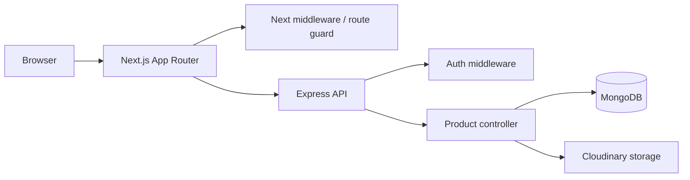
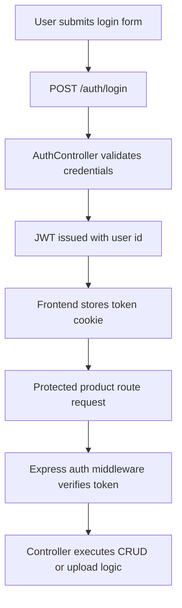

# Product CRUD Platform

Inventory management for authenticated users to create, browse, update, search, and soft-delete product records with image uploads and Cloudinary-backed storage.

[](https://opensource.org/licenses/ISC) [](https://expressjs.com/) []()

## Table of Contents

- [Overview & System Purpose](#overview--system-purpose)
- [Tech Stack Matrix](#tech-stack-matrix)
- [System Architecture & Data Flow](#system-architecture--data-flow)
- [Executable Architecture (Tree View)](#executable-architecture-tree-view)
- [Security, Auth & RBAC](#security-auth--rbac)
- [API Architecture & Endpoint Specification](#api-architecture--endpoint-specification)
- [Database Schema & Data Models](#database-schema--data-models)
- [UI Route Index & Access Control](#ui-route-index--access-control)
- [Visual Demonstration (Placeholders)](#visual-demonstration-placeholders)

## Overview & System Purpose

This workspace implements a split-stack product management application:

- A Node.js/Express backend for authentication, product CRUD, soft-delete/trash workflows, image upload, validation, and MongoDB persistence.
- A Next.js frontend using the App Router for authenticated product pages, login/register flows, and client-side routing.

The primary engineering problem addressed is a small inventory workflow with user authentication, persisted product catalog data, image handling, and basic content lifecycle operations without introducing a separate admin panel or external CMS.

Runtime variables referenced in the codebase include: MONGO_URL, JWT_SECRET, SESSION_SECRET, PORT, CLOUDINARY_CLOUD_NAME, CLOUDINARY_API_KEY, and CLOUDINARY_API_SECRET. No environment example file is present in the repository.

## Tech Stack Matrix

| Category | Technology | Usage Scope |
|---|---|---|
| Framework / Runtime | Express 5 | HTTP API server, route mounting, middleware pipeline |
| Framework / Runtime | Next.js 16 | App Router-based frontend, route guards, page rendering |
| Language | JavaScript / TypeScript | Backend runtime and frontend application logic |
| State / Data Fetching | Axios, js-cookie, React Hook Form | API requests, token handling, form state |
| Database / ORM | MongoDB, Mongoose | Product and user persistence |
| Styling / UI | React 19, Tailwind CSS, React Icons | UI components and page layouts |
| Auth & Security | bcrypt, jsonwebtoken, helmet, express-rate-limit, Joi | Password hashing, JWT issuance/verification, request hardening, validation |

## System Architecture & Data Flow

The request lifecycle is straightforward and explicit:

1. A browser requests a page or API route.
2. The Next.js layer applies route-level authentication checks through middleware.
3. Protected API requests are forwarded to the Express backend, which applies JWT validation and route-specific middleware.
4. Product writes may invoke image upload through Cloudinary storage middleware before persisting to MongoDB.
5. Product reads and search operations return JSON payloads consumed by the Next.js UI.



## Executable Architecture (Tree View)

```text
backend/
  app/
    config/             # DB and Cloudinary configuration
    controller/         # AuthController, ProductController
    middleware/         # auth, multer, validate, rate limiting
    models/             # auth and product schemas
    routes/             # /auth and /products route definitions
    utils/              # Joi validation, upload helpers, limiter
  app.js                # Express bootstrap and middleware registration
frontend/
  app/                  # App Router pages: home, auth, add/edit/trash
  components/           # Login, register, product forms, layout shells
  api/                  # Axios client and endpoint constants
  middleware.ts        # Next.js auth redirect middleware
```

## Security, Auth & RBAC

Authentication is currently implemented as a straightforward token-based flow:

- Registration creates a new user document with a bcrypt-hashed password.
- Login verifies credentials, then issues a JWT signed with JWT_SECRET and valid for 24 hours.
- The frontend stores the received token in a cookie named token and attaches it to outgoing requests through an Axios interceptor.
- The Express product routes are protected by a JWT middleware that reads an Authorization header and rejects missing or invalid tokens.
- The Next.js middleware redirects unauthenticated users away from protected routes to /auth/login.

RBAC is only partially modeled. The user schema includes a role field with enum values user/admin, but the current implementation does not enforce role-based authorization branches in the controllers or route guards.



## API Architecture & Endpoint Specification

| Method | Endpoint | Description | Auth Required |
|---|---|---|---|
| POST | /auth/register | Create a new user account | No |
| POST | /auth/login | Authenticate a user and return a JWT | No |
| GET | /products | List active products | Yes |
| GET | /products/list | Alias for listing products | Yes |
| GET | /products/add | Render the add-product view | Yes |
| POST | /products/create | Create a new product; uploads image to Cloudinary | Yes |
| GET | /products/edit/:id | Render edit-product view | Yes |
| POST | /products/update/:id | Update a product document | Yes |
| GET | /products/search | Search products by name (case-insensitive) | Yes |
| PUT | /products/soft-delete/:id | Mark a product as deleted without removing it | Yes |
| DELETE | /products/hard-delete/:id | Permanently remove a product and delete its Cloudinary asset | Yes |
| PUT | /products/restore/:id | Restore a soft-deleted product | Yes |
| GET | /products/trash | List soft-deleted products | Yes |

## Database Schema & Data Models

### auth

Represents app users.

- name: string, required
- email: string, required
- password: string, required (stored as a bcrypt hash)
- role: string, enum user/admin, default user
- isVerified: boolean, default false
- timestamps: enabled

### product

Represents inventory items.

- name: string, required, unique
- price: number, required
- brand: string, default Rupakar
- stock: number
- category: string
- image: string, default image
- public_id: string, default empty
- description: string, required
- isDeleted: boolean, default false

## UI Route Index & Access Control

| Route Path | View Purpose | Access Role |
|---|---|---|
| / | Home landing page | Authenticated |
| /home | Product listing and discovery | Authenticated |
| /auth/login | Login form | Public |
| /auth/register | Registration form | Public |
| /addProduct | Create-product form | Authenticated |
| /editProducts/[id] | Edit-product form | Authenticated |
| /trash | Soft-deleted product management | Authenticated |

## Visual Demonstration (Placeholders)

<p align="center">
  
</p>
